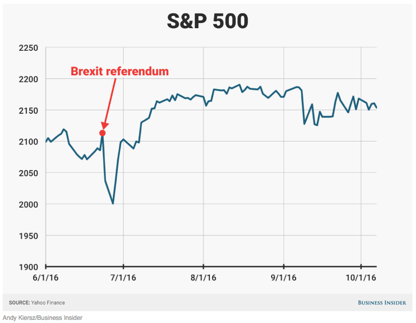
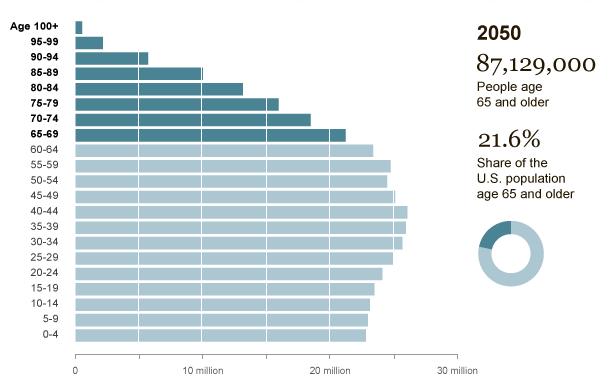
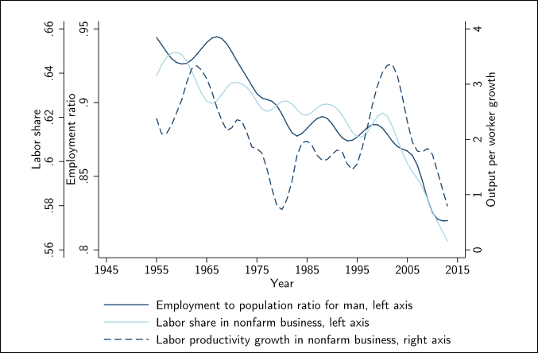
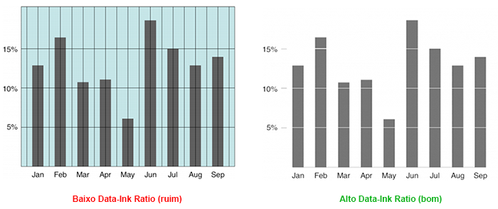
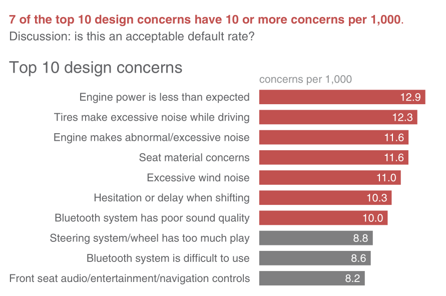

## Programa

- Fluxo da ciência de dados
- A imporância do contexto
- A escolha da visualização
- Eliminando ruído
- Escolhendo o destaque
- Ajustes estéticos
- Que história está sendo contada?

## Motivação

<center>

</center>

## Fluxo da ciência de dados
Percorremos um longo caminho nessas duas semanas. Hoje completamos o ciclo.

<center>

</center>

## A floresta e as árvores

<center>
{width=400}
</center>

Exploramos muitos detalhes de implementação nesses últimos dias. Nos concentramos em aspectos individuais de cada análise.

Hoje, queremos dar um passo atrás para pensarmos **menos no detalhe** e **mais no processo**.

No fim da contas, toda análise de dados tem um propósito. Como alcançá-lo de maneira mais efetiva?


## Elementos essesenciais da comunicação de dados

Vamos separar o processo de comunicação de dados em 6 princípios gerais:

1. O contexto importa
2. A visualização deriva dos dados
3. Separar o que é sinal e o que é ruído
4. Impor hierarquia entre os dados
5. Beleza também conta
6. Sua análise deve contar uma história


## Contexto

## Contexto

Toda análise tem um objetivo e uma audiência.

- É importante separar a exploração dos dados e a análise final. Não caia na tentação de mostrar tudo o que você fez.

- Adapte o relatório a sua audiência. Tomadores de decisão nem sempre estão interessados em detalhes de execução.

- *E daí?* Tenha em mente um objetivo específico de aprendizado. É ele que vai guiar quais informações são relevantes para seu relatório.

Números isolados não nos dizem muita coisa. Para tomar decisões com base em evidência, é preciso estabelecer uma **base de comparação** adequada para o objetivo do seu relatório. 

## Contexto pode vir em uma informação nova...

<center>
{width=600px}
</center>

## ... ou reforçar uma informação já existente

<center>

</center>


## A escolha do gráfico

## A escolha do gráfico

- [Use gráficos em vez de tabelas!](https://scholar.princeton.edu/sites/default/files/jkastellec/files/graphs.pdf)

- Que tipo de dados?

- Quantas dimensões

- A maioria dos relatórios é consumida em mídias 2D. Mostrar mais do que isso pode gerar confusão no leitor

- Cuidado com as escalas!

## Escalas podem ser enganosas

<center>
{width=600px}
</center>

## Evite eixos duplos
<center>
{width=600px}
</center>

## Ou triplos!
<center>

</center>

## Menos gráficos de pizza...

<center>

</center>


## Oof

<center>

</center>


## Menos é mais

## Eliminação de ruído

Quanto mais informações na sua visualização, maior a carga cognitiva

<center>

</center>


## Data-ink ratio

Quanto mais informações na sua visualização, maior a carga cognitiva

<center>

</center>


## Limpeza passo a passo

<center>

</center>

## Eliminação da borda

<center>

</center>


## Limpeza das grades

<center>

</center>


## Tirando os pontos

<center>

</center>

## Processamento dos eixos

<center>

</center>

## Ajeitando o rótulo

<center>

</center>


## Ajuste de cores

<center>

</center>

## Antes e depois

<center>

</center>


## Hierarquia entre os dados

## Conte os dígitos 3

<center>

</center>


## Conte os dígitos 3

<center>

</center>


## Formas de chamar atenção

<center>

</center>


## Destaque por cores

<center>

</center>


## Voltando ao nosso exemplo

<center>

</center>

## Voltando ao nosso exemplo

<center>

</center>


## Use cores de maneira estratégica

<center>

</center>


## Nem todos os dados têm a mesma importância

## Enfatizando o ponto principal

<center>

</center>

## Enfatizando o ponto principal

<center>
{width=600px}
</center>

## Enfatizando o ponto principal

<center>
{width=600px}
</center>


## Contando sua história

## Amarrando todos os passos

Vamos contar uma história partindo do gráfico abaixo, fazendo passo a passo as adaptações sobre as quais conversamos. O que ele está te dizendo?
<center>
{width=500px}
</center>


## Amarrando todos os passos

<center>

</center>


## Amarrando todos os passos

<center>

</center>

## Amarrando todos os passos
<center>

</center>


## Amarrando todos os passos
<center>

</center>


## Narrativa final

<center>

</center>

## Narrativa final

<center>

</center>

## Narrativa final

<center>

</center>


## Narrativa final

<center>

</center>


## Narrativa final

<center>

</center>


## Narrativa final

<center>

</center>

## Narrativa final

<center>

</center>

## Narrativa final

<center>

</center>

## Antes e depois

<center>

</center>


## Aplicação: Evolução Covid-19
```{r message=FALSE, warning=FALSE, results='hide'}
# remotes::install_github("kjhealy/covdata")
# library(covdata)
library(tidyverse)
library(ggrepel)
library(Cairo)
library(slider)
library(ggforce)

covnat <- read_csv(here("data","covdata.csv"))
load(here("data","nytexcess.rda"))

```


## Evolução Covid-19
```{r echo=FALSE, message=FALSE, warning=FALSE, dev='CairoPNG', fig.align='center'}
## Função Not In
"%nin%" <- function(x, y) {
  return( !(x %in% y) )
}


focus_cn <- c("CHN", "DEU", "GBR", "USA", "IRN", "JPN",
              "KOR", "ITA", "FRA", "ESP", "CHE", "TUR")

cgroup_cols <- c("#195F90FF", "#D76500FF", "#238023FF", "#AB1F20FF", "#7747A3FF", 
                 "#70453CFF", "#D73EA8FF", "#666666FF", "#96971BFF", "#1298A6FF", "#6F9BD6FF", 
                 "#FF952DFF", "gray70")

covnat %>%
  filter(cu_cases > 99) %>%
  mutate(days_elapsed = date - min(date),
        end_label = ifelse(date == max(date), cname, NA),
        end_label = recode(end_label, `United States` = "USA",
                            `Iran, Islamic Republic of` = "Iran",
                            `Korea, Republic of` = "South Korea",
                            `United Kingdom` = "UK"),
         cname = recode(cname, `United States` = "USA",
                        `Iran, Islamic Republic of` = "Iran",
                        `Korea, Republic of` = "South Korea",
                        `United Kingdom` = "UK"),
         end_label = case_when(iso3 %in% focus_cn ~ end_label,
                               TRUE ~ NA_character_), 
         cgroup = case_when(iso3 %in% focus_cn ~ iso3, 
                            TRUE ~ "ZZOTHER")) %>%
  ggplot(mapping = aes(x = days_elapsed, y = cu_cases, 
         color = cgroup, label = end_label, 
         group = cname)) + 
  geom_line(size = 0.5) + 
  geom_text_repel(nudge_x = 0.75,
                  segment.color = NA) + 
  guides(color = FALSE) + 
  scale_color_manual(values = cgroup_cols) +
  scale_y_continuous(labels = scales::comma_format(accuracy = 1), 
                     breaks = 2^seq(4, 20, 1),
                     trans = "log2") + 
  labs(x = "Days Since 100th Confirmed Case", 
       y = "Cumulative Number of Reported Cases (log2 scale)", 
       title = "Cumulative Reported Cases of COVID-19, Selected Countries", 
       subtitle = paste("ECDC data as of", format(max(covnat$date), "%A, %B %e, %Y")), 
       caption = "Kieran Healy @kjhealy / Data: https://www.ecdc.europa.eu/") +
  theme_minimal()

```

## Média móvel
```{r echo=FALSE, message=FALSE, warning=FALSE, dev='CairoPNG', fig.align='center'}
covnat %>%
  mutate(cname = recode(cname, `United States` = "USA",
                        `Iran, Islamic Republic of` = "Iran",
                        `Korea, Republic of` = "South Korea",
                        `United Kingdom` = "UK"),
         cgroup = case_when(iso3 %in% focus_cn ~ iso3, 
                            TRUE ~ "ZZOTHER")) %>%
  mutate(cases7 = slider::slide_dbl((deaths/pop)*1e6, mean, .before = 7, .after = 0, na.rm = TRUE),
         deaths7 = slider::slide_dbl((deaths/pop)*1e6, mean, .before = 7, .after = 0, na.rm = TRUE)) %>%
  filter(iso3 %in% focus_cn) %>%
  ggplot(mapping = aes(x = date, y = deaths7)) + 
  geom_line(size = 0.5) + 
  facet_wrap(~ cname) +
  labs(x = "Date", 
       y = "Deaths per Million Population (Seven Day Rolling Average)", 
       title = "Deaths from COVID-19, Selected Countries", 
       subtitle = paste("ECDC data as of", format(max(covnat$date), "%A, %B %e, %Y")), 
       caption = "Kieran Healy @kjhealy / Data: https://www.ecdc.europa.eu/") +
  theme_minimal()

```


## Mortes em Nova York
```{r echo=FALSE, message=FALSE, warning=FALSE, dev='CairoPNG', fig.align='center'}
nytexcess %>%
  filter(placename == "New York City") %>%
  group_by(year, week) %>%
  mutate(yr_ind = year %in% 2020) %>%
  ggplot(aes(x = week, y = deaths, color = yr_ind, group = year)) + 
  geom_line(size = 0.9) + 
  scale_color_manual(values = c("gray70", "red"), labels = c("2017-2019", "2020")) +
  scale_y_continuous(labels = scales::comma) +
  labs(x = "Week of the Year", 
       y = "Total Deaths", 
       color = "Year",
       title = "Weekly recorded deaths in New York City, 2017-2020") + 
  theme_minimal() + 
  theme(legend.position = "top")

```

## Material adicional

- [Flowing Data](https://flowingdata.com/)
- [Information is Beautiful](https://informationisbeautiful.net/blog/)
- [The Functional Art](http://www.thefunctionalart.com/)
- [Covid no Financial Times](https://www.ft.com/content/a2901ce8-5eb7-4633-b89c-cbdf5b386938)


## Tarefa da aula

As instruções da tarefa estão no arquivo `NN-class-ds4ir-assignment.rmd` da pasta 
`assignment` que se encontra na raiz desse projeto.


